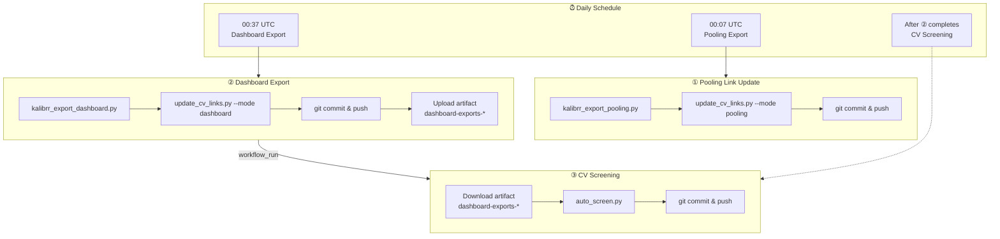
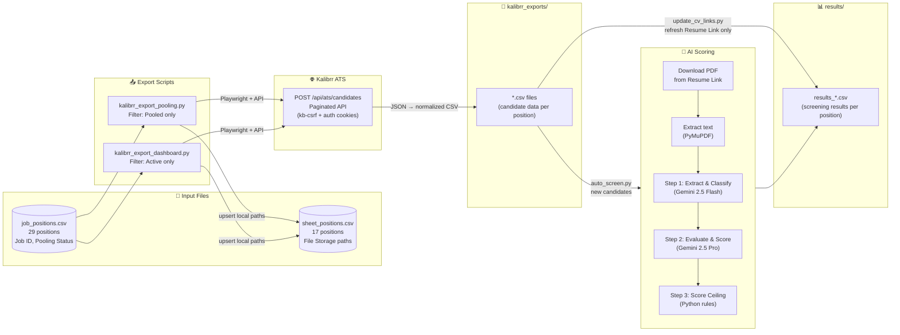

# CV Matching Pipeline — Flow & Bug Analysis

## Overall Architecture



## Detailed Data Flow



## Per-Workflow Breakdown

### ① Pooling Link Update (00:07 UTC)
```
job_positions.csv (Pooled only)
        │
        ▼
kalibrr_export_pooling.py
        │
        ├── Playwright → Kalibrr API (paginated)
        │       ↓
        │   kalibrr_exports/{position}.csv  ←── candidate data
        │       ↓
        └── sheet_positions.csv  ←── upsert File Storage = "kalibrr_exports/..."
                │
                ▼
update_cv_links.py --mode pooling
        │
        ├── Read sheet_positions.csv (pooled positions only)
        ├── Read kalibrr_exports/{position}.csv (fresh data)
        ├── Read results/results_{position}.csv (existing)
        └── Update ONLY "Resume Link" column → save back
                │
                ▼
        git add & commit & push:
          - sheet_positions.csv
          - results/*.csv
          - kalibrr_exports/*.csv  (⚠️ ignored by .gitignore!)
        upload artifact: kalibrr_exports/
```

### ② Dashboard Export (00:37 UTC)
```
Same as ① but:
  - Filter: Active positions (NOT Pooled)
  - Script: kalibrr_export_dashboard.py
  - update_cv_links.py --mode dashboard
  - Artifact: dashboard-exports-{run_number}
```

### ③ CV Screening (triggered by ② success)
```
Download artifact: dashboard-exports-* → kalibrr_exports/
Checkout: latest commit on main
        │
        ▼
auto_screen.py
        │
        ├── job_positions.csv → active positions only (10)
        ├── sheet_positions.csv → File Storage path per position
        │
        │   For each position:
        │   ├── Load candidates: sheet_positions.csv File Storage path
        │   │     └── Fallback: kalibrr_exports/{safe_name}.csv
        │   ├── Load existing results → skip already-processed (by email)
        │   │
        │   │   For each NEW candidate:
        │   │   ├── Download PDF (resume link from CSV)
        │   │   ├── Extract text (PyMuPDF)
        │   │   ├── AI Score (Flash → Pro → Ceiling)
        │   │   └── Save result (GitHub API + local)
        │   └── ───────────────────────────────
        │
        ▼
git add results/*.csv logs/*.json
git commit & push
```

---

## 🐛 Known Bugs & Issues

### BUG 1: `kalibrr_exports/` in `.gitignore` — FILES NEVER ACTUALLY COMMITTED
**Status:** 🔴 ACTIVE — root cause of all "File not found" errors

`.gitignore` contains:
```
kalibrr_exports/
```

This means `git add kalibrr_exports/*.csv` **silently does nothing** (unless `-f` flag is used). Even though workflows ① and ② try to commit these files, git ignores them.

**Impact:**
- Workflow ③ checks out repo → `kalibrr_exports/` is empty → all positions fail with "File not found"
- `update_cv_links.py` in ② works fine because it runs on the SAME runner where files were just exported

**Fix options:**
| Option | Approach | Pros | Cons |
|--------|----------|------|------|
| A | Remove `kalibrr_exports/` from `.gitignore` | Simple, files always available | Bloats repo history with large CSVs |
| **B** ✅ | Artifacts only (current approach) | Clean, no repo bloat | Need artifact download in ③ |
| C | `git add -f kalibrr_exports/*.csv` | Overrides `.gitignore` | Confusing — tracked files in ignored dir |

**Current fix:** Option B is partially implemented — ③ downloads artifacts, BUT the `git add` in ① and ② still silently fails. Those lines should be removed to avoid confusion.

### BUG 2: Artifact Download Only Covers Dashboard Exports
**Status:** 🟡 Minor

Workflow ③ only downloads `dashboard-exports-*` artifacts. If a position was exported by pooling (①) but NOT by dashboard (②), the CSV won't be available in ③.

**This is currently OK** because ③ only screens active (non-pooled) positions, so pooling CSVs are not needed.

### BUG 3: `sheet_positions.csv` Contains Stale Local Paths
**Status:** 🟡 Cosmetic

`File Storage` column has values like `kalibrr_exports/Software_Engineer.csv`. This works within a single runner but is misleading — it's not a URL, it's a relative path that only works if the file exists locally.

**Impact:** If someone tries to use `sheet_positions.csv` outside of the GitHub Actions context (e.g., local dev, Streamlit app), the paths won't resolve unless files are present.

### BUG 4: Dead Code in `auto_screen.py`
**Status:** ⚪ Cleanup

`fetch_candidates_from_kalibrr()` function (~100 lines) duplicates `kalibrr_core.py`'s `export_position()` and is never called.

### BUG 5: Double-Write Results (API + git commit)
**Status:** ⚪ By Design

`auto_screen.py` writes each result via GitHub Contents API immediately (resilience), then the workflow does `git add results/*.csv && git commit && git push` at the end. This is intentional for crash recovery but can cause merge conflicts if timing is unlucky.

---

## ✅ Action Items

| # | Priority | Action | Bug |
|---|----------|--------|-----|
| 1 | 🔴 HIGH | Remove useless `git add kalibrr_exports/*.csv` from workflow ① and ② (they're in `.gitignore`, so it's a no-op) | BUG 1 |
| 2 | 🔴 HIGH | Verify artifact download in ③ works correctly (test with `workflow_dispatch`) | BUG 1 |
| 3 | 🟡 MED | Also download `pooling-exports-*` in ③ if pooled positions ever need screening | BUG 2 |
| 4 | 🟡 MED | Consider storing File Storage as artifact names instead of local paths | BUG 3 |
| 5 | ⚪ LOW | Remove dead `fetch_candidates_from_kalibrr()` from `auto_screen.py` | BUG 4 |
